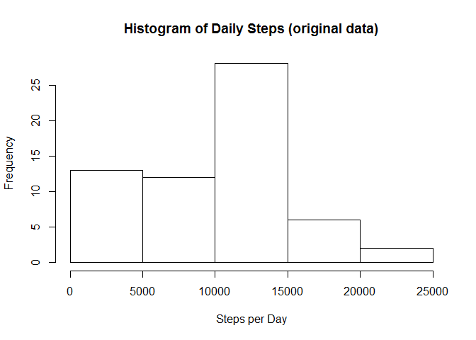
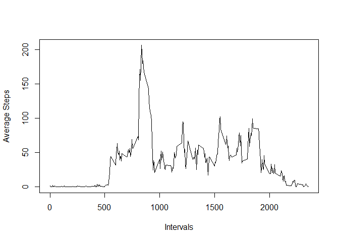
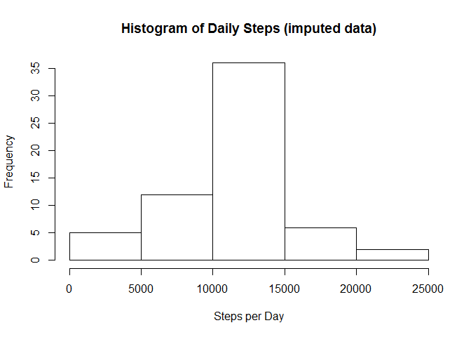
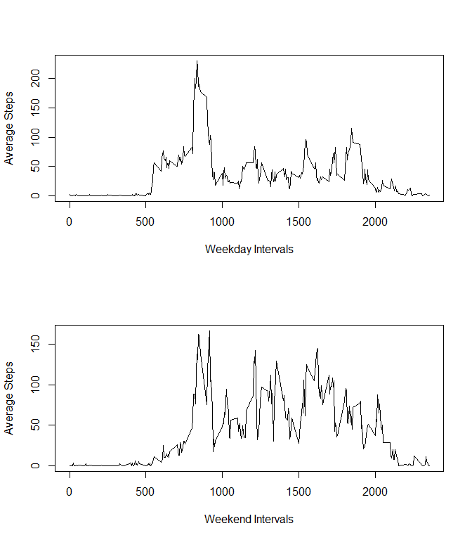

# Reproducible Research: Project 1
M. Nelson  
January 8, 2016  


## Loading and preprocessing the data


```r
# Read in the data
actData <- read.csv("./activity.csv")

# For wrangling data
library(dplyr)

# For manipulating dates
library(timeDate)

# Coerce the date column to be of type date
actData <- mutate(actData, date = as.Date(date))

# To suppress scientific notation on printouts
options(scipen = 999)
```


## What is mean total number of steps taken per day?


```r
# Add column with daily step counts for each row
actData <- actData %>%
    group_by(date) %>%
    mutate(dailySteps = sum(steps, na.rm = TRUE)) %>%
    ungroup()

# Select only one row per day for plotting
daily <- actData %>%
    select(date, dailySteps) %>%
    distinct()

# Plot the histogram
hist(daily$dailySteps, xlab = "Steps per Day", main = "Histogram of Daily Steps (original data)")
```

 

```r
# Prepare variables with mean/median steps per day.
dailyMean <- round(mean(daily$dailySteps), 0)
dailyMedian <- round(median(daily$dailySteps), 0)
```
###Results:
The mean number of steps taken each day (excluding NAs) is: 9354.  
The median number of steps taken each day (excluding NAs) is: 10395.  


## What is the average daily activity pattern?


```r
# Add column with interval average counts for each row
actData <- actData %>%
    group_by(interval) %>%
    mutate(intAvg = mean(steps, na.rm = TRUE)) %>%
    ungroup()

# Select only one row per interval for plotting and finding max
intervals <- actData %>%
    select(interval, intAvg) %>%
    distinct()

# Plot the time series of interval number vs. average steps in that interval
plot(intervals$interval, intervals$intAvg, type = "l", xlab = "Intervals", ylab = "Average Steps")
```

 

```r
# Find the interval that had the highest average number of steps
mostActive <- intervals %>%
    filter(intAvg == max(intervals$intAvg)) %>%
    select(interval) %>%
    as.integer()
```
###Results:
The 5-minute interval that on average has the maximum number of steps (excluding NAs) is interval: 835.  


## Imputing missing values


```r
# Sum the total rows with missing step data
NAcount <- sum(is.na(actData$steps))

# Create new imputed data frame by inserting the interval average steps if steps is NA
imputedData <- mutate(actData, steps = ifelse(is.na(steps), intAvg, steps))

# Re-calc daily steps with imputed data
imputedData <- imputedData %>%
    group_by(date) %>%
    mutate(dailySteps = sum(steps)) %>%
    ungroup()

# Select only one row per day for plotting
impDaily <- imputedData %>%
    select(date, dailySteps) %>%
    distinct()

# Plot the histogram
hist(impDaily$dailySteps, xlab = "Steps per Day", main = "Histogram of Daily Steps (imputed data)")
```

 

```r
# Prepare variables with mean/median steps per day.
impDailyMean <- round(mean(impDaily$dailySteps), 0)
impDailyMedian <- round(median(impDaily$dailySteps), 0)
```
###Results:
The number rows with NA values for steps is: 2304.  
The mean number of steps taken each day is: 10766.  
The median number of steps taken each day is: 10766.  

Total daily number of steps is greater with the imputed data because it has replaced NA with additional estimated missing step counts.
  

## Are there differences in activity patterns between weekdays and weekends?


```r
# Add a column with factor for weekend or weekday
imputedData <- mutate(imputedData, typeOfDay = as.factor(ifelse(isWeekend(date), "weekend", "weekday")))

# Re-calc interval average counts with imputed data
imputedData <- imputedData %>%
    group_by(typeOfDay, interval) %>%
    mutate(intAvg = mean(steps)) %>%
    ungroup()

# Select only one row per interval for plotting for each type of day
wDayIntervals <- imputedData %>%
    filter(typeOfDay == "weekday") %>%
    select(interval, intAvg) %>%
    distinct()
wEndIntervals <- imputedData %>%
    filter(typeOfDay == "weekend") %>%
    select(interval, intAvg) %>%
    distinct()
    
# Plot the time series of interval number vs. average steps in that interval
par(mfcol = c(2,1))
plot(wDayIntervals$interval, wDayIntervals$intAvg, type = "l", xlab = "Weekday Intervals", ylab = "Average Steps")
plot(wEndIntervals$interval, wEndIntervals$intAvg, type = "l", xlab = "Weekend Intervals", ylab = "Average Steps")
```

 


